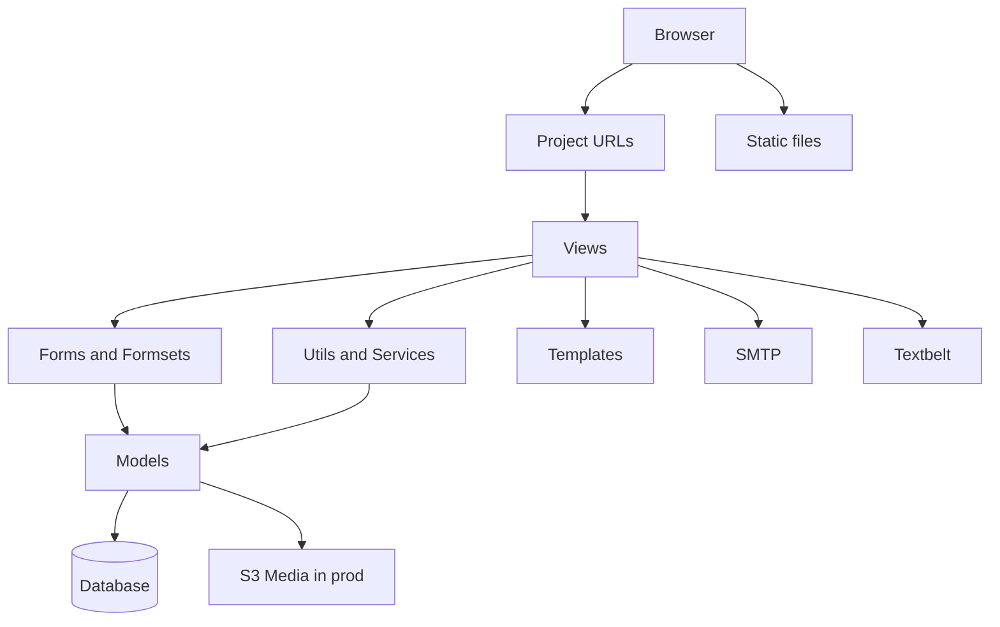

# 01 — Architecture Overview

Let’s start with the 10-second mental model:

> A user clicks in the browser → Django view validates input → models/services update data → Django renders HTML back.

---

## Architecture map (Mermaid)



## Same diagram (ASCII fallback)

```text
[Browser]
   |
   v
[urls.py router] ---> [Views] ---> [Templates] ---> HTML response
                        |  \
                        |   +--> [Utils/Services] --> [Models] --> [DB]
                        |
                        +--> [Forms/Formsets] -----> [Models] --> [DB]

External integrations:
- Email notifications -> SMTP
- SMS notifications   -> Textbelt
- Uploaded media      -> local media (dev) / S3 (prod)
```

> Tip: If Mermaid does not render in your previewer, use the ASCII fallback blocks throughout this guide.

---

## Main packages
- `accounts`: onboarding, org membership, invitations, Google OAuth hooks.
- `supplychain`: requisitions, purchase orders, receiving, payments, inventory.
- `supplychain_test/settings`: environment-specific configuration.

## Request path pattern (real code shape)
1. URL pattern resolves to a view class/function.
2. View checks authentication/permissions.
3. View validates a form/formset.
4. View writes/reads models (sometimes via `utils.py` or `services/*`).
5. View renders template with context.

## Why this architecture is nice
- Simple server-rendered Django flow (great for maintainability).
- State transitions are explicit in `status` fields.
- Inventory is transaction-based (`StockTransaction`) instead of a fragile mutable single counter.
