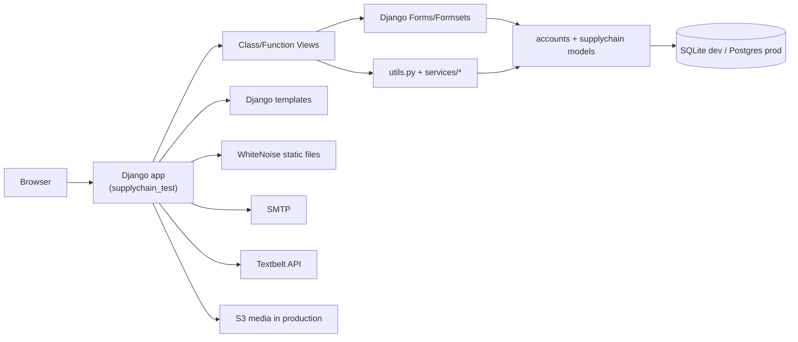

# 01 — Architecture Overview

## High-level architecture

## Main packages
- `accounts`: organization onboarding, invite flow, optional Google OAuth.
- `supplychain`: procurement/inventory/payment domain.
- `supplychain_test/settings`: env-specific settings split.

## Request path pattern
`urls.py` → view class/function → form/formset validation → model write/read → template render.

## Notable design traits
- Most workflows are server-rendered pages (no DRF API layer).
- Workflow state is represented in model `status` fields.
- Timeline/event rendering is centralized in `supplychain/utils.py`.
- Inventory stock is event-sourced from `StockTransaction` rows (signed quantities).
