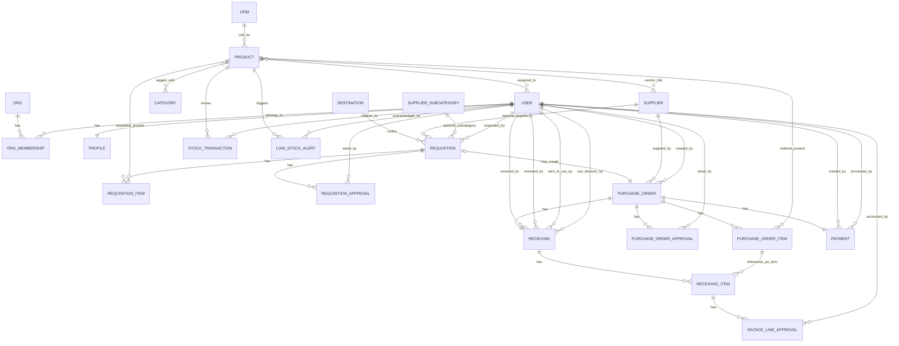

# 04 — Data Model ERD

This chapter shows **all models** and how they connect. Read the text fallback first; use Mermaid as reinforcement.

## ERD (Mermaid)



## Text fallback (same diagram in plain text)

```text
Organization and users
  ORG --< ORG_MEMBERSHIP >-- USER
  USER --1 PROFILE

Product catalog
  UOM --< PRODUCT >-- CATEGORY
  PRODUCT --<-> SUPPLIER (vendors M2M)
  PRODUCT --<-> USER (assigned_users M2M)

Requisition domain
  DESTINATION --< REQUISITION >-- SUPPLIER (optional)
  SUPPLIER_SUBCATEGORY --< REQUISITION (optional)
  USER --< REQUISITION (requester)
  REQUISITION --< REQUISITION_ITEM >-- PRODUCT
  REQUISITION --< REQUISITION_APPROVAL >-- USER

Purchase domain
  REQUISITION --0..1 PURCHASE_ORDER
  PURCHASE_ORDER --< PURCHASE_ORDER_ITEM >-- PRODUCT
  PURCHASE_ORDER --< PURCHASE_ORDER_APPROVAL >-- USER

Receiving domain
  PURCHASE_ORDER --1 RECEIVING
  RECEIVING --< RECEIVING_ITEM >-- PURCHASE_ORDER_ITEM
  RECEIVING_ITEM --< INVOICE_LINE_APPROVAL >-- USER
  RECEIVING also tracks users: received_by, reviewed_by, sent_to_coo_by, coo_decision_by

Payment and inventory
  PURCHASE_ORDER --1 PAYMENT
  PAYMENT links USER as created_by and processed_by
  PRODUCT --< STOCK_TRANSACTION >-- USER
  PRODUCT --< LOW_STOCK_ALERT >-- USER
```

## Why these relationships exist
- Approval tables (`*_APPROVAL`) keep an immutable decision history.
- `STOCK_TRANSACTION` is append-only so stock can be recalculated and audited.
- One receiving and one payment per PO make finance workflow deterministic.

## Where in code
- Accounts models: `supplychain_test/accounts/models.py::OrganizationMembership`
- Product/master data: `supplychain_test/supplychain/models/master_data.py::Product`
- Requisition domain: `supplychain_test/supplychain/models/requisition.py::RequisitionApproval`
- Purchase domain: `supplychain_test/supplychain/models/purchase.py::PurchaseOrderApproval`
- Receiving domain: `supplychain_test/supplychain/models/receiving.py::InvoiceLineApproval`
- Payment/inventory: `supplychain_test/supplychain/models/payment.py::Payment`, `supplychain_test/supplychain/models/inventory.py::StockTransaction`
