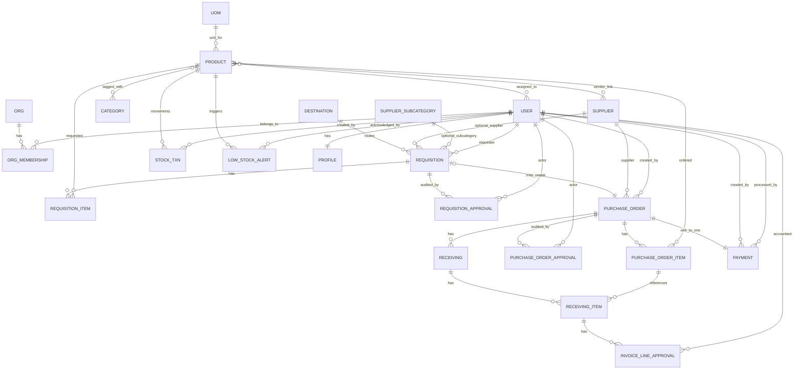

# 04 — Data Model ERD

This section gives you two views:
1. A **Mermaid ERD** (for tools that support it).
2. A **plain-English relationship map** (for first-glance understanding).

---

## ERD (Mermaid)



---

## Relationship map (quick human read)

```text
Organization
  └─< OrganizationMembership >─ User

Product master data
  UOM ──< Product >── Category
                 └── Supplier (vendors)
                 └── User (assigned users)

Procurement chain
  Requisition ──< RequisitionItem
      └──< RequisitionApproval
      └──(0..1) PurchaseOrder ──< PurchaseOrderItem
                                 └──< PurchaseOrderApproval
                                 └──(1) Payment
                                 └──(1) Receiving ──< ReceivingItem
                                                     └──< InvoiceLineApproval

Inventory chain
  Product ──< StockTransaction
  Product ──< LowStockAlert
```

---

## Constraint highlights
- Unique membership per user/org.
- Unique requisition line per product per requisition.
- Unique payment per PO.
- Unique receiving per PO.
- Unique stock transaction per `(type, source_type, source_id, product)` for idempotency.

> Gotcha: Mermaid ER rendering can vary by Markdown engine. If your preview breaks, rely on the relationship map above (same logic, no parser dependency).
