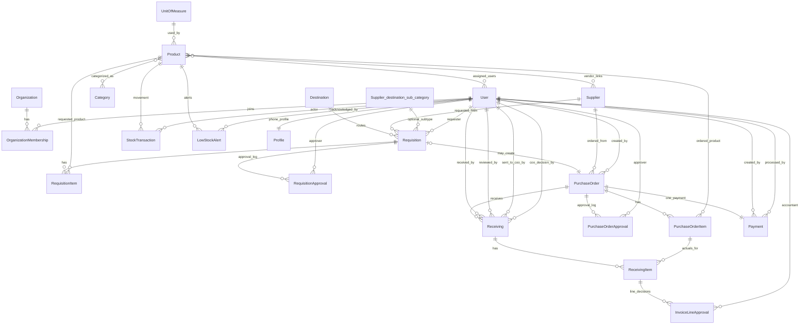

# 04 — Data Model ERD

## Constraints and indexes highlights
- Unique membership: `(user, organization)`.
- Product uniqueness: `(Lower(name), uom)` via `uniq_product_sku` constraint name.
- RequisitionItem uniqueness: `(requisition, product)`.
- One payment per PO and one receiving per PO unique constraints.
- Stock idempotency: unique `(transaction_type, source_type, source_id, product)`.
