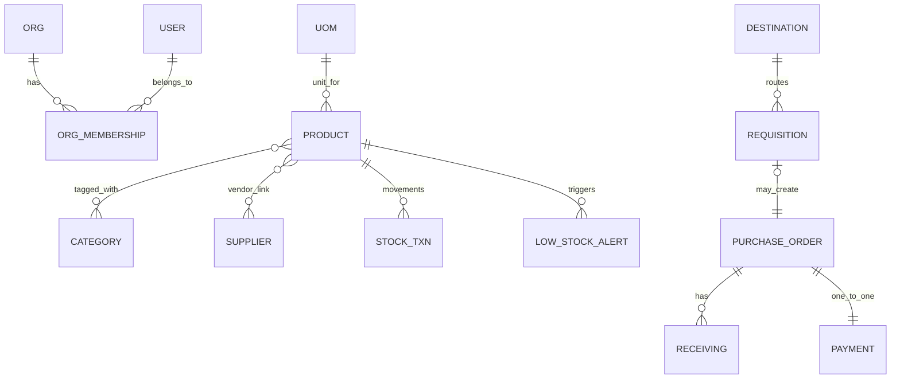

# 04 — Data Model Relationship Guide (No-render friendly)

If your Markdown preview does not render Mermaid, this page is the source of truth.

## Core relationship story (in plain English)

1. Organizations have users through memberships.
2. Products belong to a master catalog (UOM, categories, vendors, assigned users).
3. Requisitions contain line items and approval history.
4. A requisition may become one purchase order.
5. A purchase order has lines, approvals, one receiving lifecycle, and one payment lifecycle.
6. Receiving lines compare expected vs actual quantities.
7. Inventory moves through stock transactions.
8. Low stock alerts are generated from computed on-hand vs threshold.

---

## Text ER map

```text
Organization
  └─< OrganizationMembership >─ User

Product master data
  UnitOfMeasure ──< Product >── Category
                         └────── Supplier (vendors)
                         └────── User (assigned users)

Procurement pipeline
  Destination ──< Requisition >── Supplier(optional)
                     └── SupplierSubCategory(optional)
                     └──< RequisitionItem >── Product
                     └──< RequisitionApproval >── User
                     └──(0..1) PurchaseOrder >── Supplier
                                        └──< PurchaseOrderItem >── Product
                                        └──< PurchaseOrderApproval >── User
                                        └──(1) Receiving
                                        |      └──< ReceivingItem >── PurchaseOrderItem
                                        |              └──< InvoiceLineApproval >── User
                                        └──(1) Payment >── User(created_by/processed_by)

Inventory + alerts
  Product ──< StockTransaction >── User(created_by)
  Product ──< LowStockAlert >── User(acknowledged_by)
  User ──|| Profile
```

---

## Mermaid version (optional)



---

## High-impact constraints to know
- One membership row per user-org pair.
- One payment per PO.
- One receiving per PO.
- One requisition line per product per requisition.
- One stock posting per `(type, source_type, source_id, product)`.
