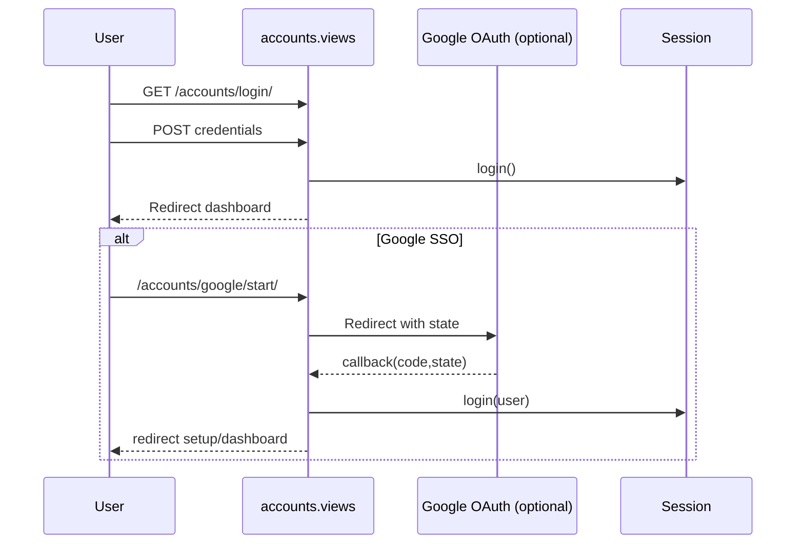

# 05 — Authentication and Permissions

## Authentication stack
- Django session auth + built-in auth URLs (`django.contrib.auth.urls`).
- Custom login landing: `accounts.views::auth_landing`.
- Signup + org bootstrap in `accounts.views::signup`.
- Optional Google OAuth (`google_start`, `google_callback`).

## Authorization mechanisms
- `PermissionRequiredMixin` in most supplychain views.
- Per-object guards (e.g., requisition requester-only edits).
- Organization-level invite guard with owner/admin role check.

## Permission map (custom)
- Requisition: `submit_requisition`, `approve_requisition`, `view_all_requisitions`.
- PO: `create_purchaseorder`, `approve_purchaseorder`.
- Receiving: `record_receiving`, `review_receiving`, `approve_receiving`.
- Payment: `process_payment`.
- Product ops: `bulk_upload_products`.
- Low stock: `acknowledge_lowstock`.

## Auth flow diagram

> Tip: Organization context is stored in session key `active_organization_id` and reused across dashboard/invite flows.
