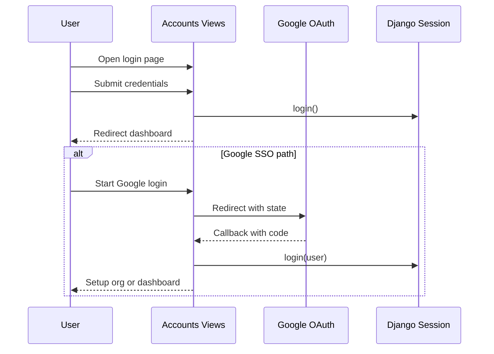

# 05 — Authentication and Permissions

## Authentication stack
- Django session auth + built-in auth URLs (`django.contrib.auth.urls`).
- Custom login landing in `accounts.views::auth_landing`.
- Signup + organization bootstrap in `accounts.views::signup`.
- Optional Google OAuth (`google_start`, `google_callback`).

---

## Auth flow diagram

### Mermaid


### ASCII fallback
```text
Local login:
  user -> /accounts/login -> AuthenticationForm valid -> login() -> dashboard

Google login:
  user -> google/start -> google callback -> user lookup/create -> login()
       -> if no organization membership -> organization setup
       -> else dashboard
```

---

## Authorization mechanisms
- `PermissionRequiredMixin` on most supplychain views.
- Per-object checks (example: requester can only edit queried requisitions they own).
- Organization invite guard (`owner` or `admin` role required).

## Custom permission map
- Requisition: `submit_requisition`, `approve_requisition`, `view_all_requisitions`.
- Purchase order: `create_purchaseorder`, `approve_purchaseorder`.
- Receiving: `record_receiving`, `review_receiving`, `approve_receiving`.
- Payment: `process_payment`.
- Product operations: `bulk_upload_products`.
- Inventory alerts: `acknowledge_lowstock`.

## Session behavior
- Active organization is stored in `request.session["active_organization_id"]`.
- Session expiry is short and sliding (15 minutes with refresh on activity).

> Tip: When debugging access issues, check both Django permissions **and** organization membership role.


## Where in code
- Login and signup: `supplychain_test/accounts/views.py::auth_landing`, `supplychain_test/accounts/views.py::signup`
- OAuth flow: `supplychain_test/accounts/views.py::google_start`, `supplychain_test/accounts/views.py::google_callback`
- Invite permissions: `supplychain_test/accounts/views.py::_user_can_invite`
- Session redirects: `supplychain_test/supplychain_test/settings/base.py::LOGIN_REDIRECT_URL`
- Permission checks in views: `supplychain_test/supplychain/views/requisition_views.py::RequisitionCreateView`, `supplychain_test/supplychain/views/payments_views.py::PaymentDetailView`
