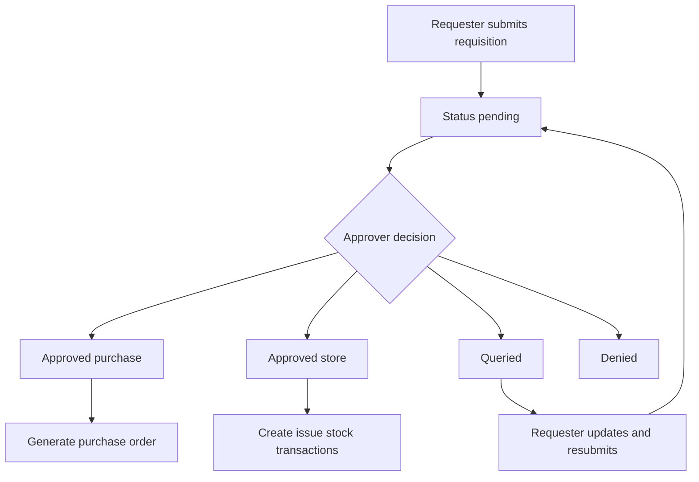
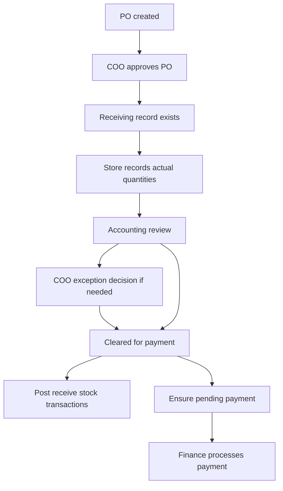
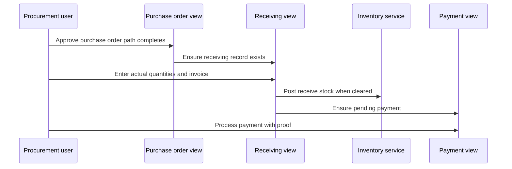

# 06 — Core Workflows (Step-by-step)

This chapter follows one request from creation to payment and inventory effects.

## Workflow 1: Requisition lifecycle

### Plain-English walkthrough
First, a requester creates a requisition with line items.
Then the requisition waits in `PENDING`.
Then an approver chooses approved, queried, or denied.
Because destination controls downstream behavior, approved requisitions split:
- `PURCHASE` creates a purchase order.
- `STORE` posts stock issue transactions.

### Mermaid


### Text fallback
```text
Requester submits requisition
  -> status becomes pending
  -> approver decides:
     - approved + purchase: create purchase order
     - approved + store: post issue stock transactions
     - queried: requester edits and resubmits to pending
     - denied: workflow ends
```

### Where in code
- URL routes: `supplychain_test/supplychain/urls.py::urlpatterns`
- Create/update/detail views: `supplychain_test/supplychain/views/requisition_views.py::RequisitionCreateView`, `supplychain_test/supplychain/views/requisition_views.py::RequisitionUpdateView`, `supplychain_test/supplychain/views/requisition_views.py::RequisitionDetailView`
- Side effects: `supplychain_test/supplychain/utils.py::generate_po_for_requisition`, `supplychain_test/supplychain/services/inventory.py::record_store_requisition_issue`

---

## Workflow 2: PO to receiving to payment (flowchart)

### Plain-English walkthrough
First, procurement creates or receives a PO from approved requisition.
Then COO approves the PO.
Then the system ensures receiving lines exist.
Then receiving is recorded and reviewed.
If the review clears payment, stock is posted as receive movements and a pending payment record exists.
Finally finance processes the payment.

### Mermaid


### Text fallback
```text
PO created -> COO approval -> receiving exists
-> store entry -> accounting review
-> optional COO exception decision
-> if cleared: post receive stock + ensure pending payment
-> finance processes payment
```

### Where in code
- PO decision: `supplychain_test/supplychain/views/purchaseorder_views.py::PurchaseOrderDetailView`
- Receiving orchestration: `supplychain_test/supplychain/views/receiving_views.py::ReceivingDetailView`
- Receiving generation: `supplychain_test/supplychain/utils.py::generate_receiving_for_purchase_order`
- Stock posting: `supplychain_test/supplychain/services/inventory.py::record_receiving_as_stock`
- Payment processing: `supplychain_test/supplychain/views/payments_views.py::PaymentDetailView`

---

## Workflow 3: PO to receiving to payment (sequence)

### Mermaid


### Text fallback
```text
Procurement/approver action
  -> receiving screen has lines to fill
  -> receiving review clears payment
  -> inventory receive transactions are posted
  -> payment is processed
```

## Workflow 4: Bulk product upload

### Plain-English walkthrough
First, user uploads CSV/XLSX.
Then each row is validated.
Then product records are created/updated.
Because stock is event-based, the importer computes difference from current stock and writes adjustment transactions.

### Where in code
- Upload endpoint: `supplychain_test/supplychain/views/product_bulk_upload_views.py::ProductBulkUploadView`
- Import service: `supplychain_test/supplychain/services/uploads/product_bulk_upload.py::import_products_df`
