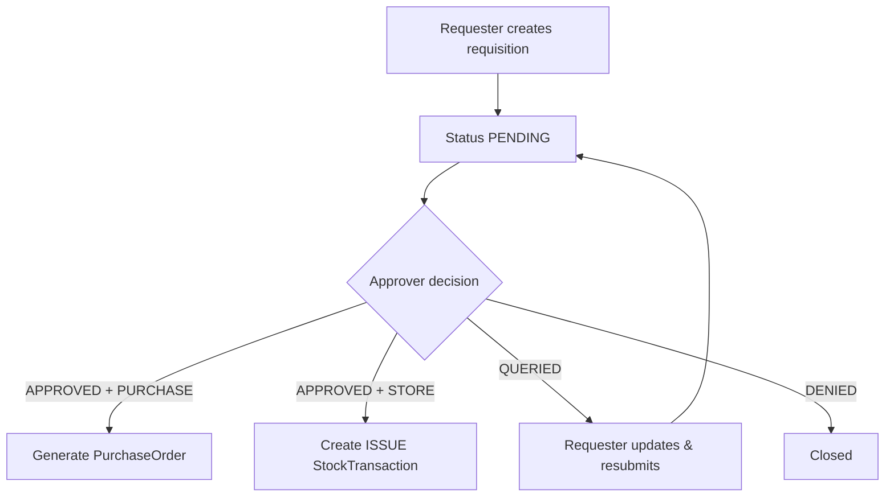
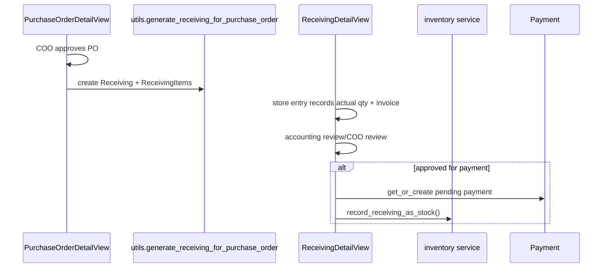

# 06 — Core Workflows

## 1) Requisition lifecycle

Path: `supplychain/urls.py` → `Requisition*View` → `RequisitionForm + RequisitionItemFormSet` → models.

## 2) Purchase → Receiving → Payment

## 3) Bulk product upload workflow
- Upload CSV/XLSX in `ProductBulkUploadView`.
- `import_products_df` validates columns, upserts products, assigns categories/vendors/users.
- Calculates stock diff and writes ADJUST_IN/ADJUST_OUT transactions with shared `upload_id`.
