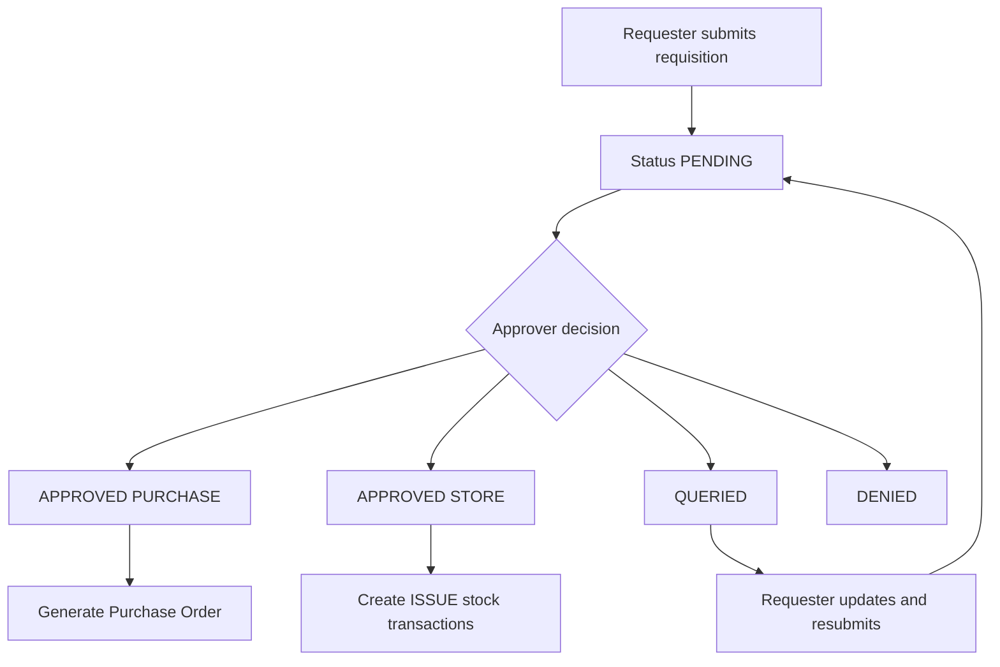
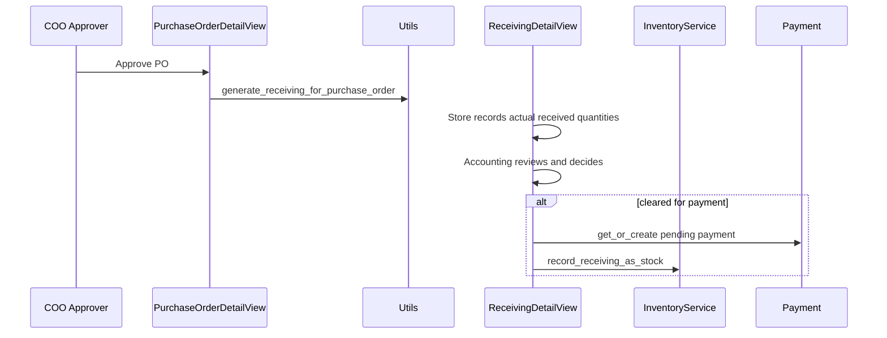
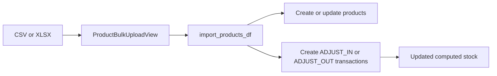

# 06 — Core Workflows

This is the “follow the ball” chapter.

---

## Workflow A: Requisition lifecycle

### Mermaid


### ASCII fallback
```text
Requester -> PENDING -> Approver decides
   |- APPROVED + PURCHASE -> create PO
   |- APPROVED + STORE    -> issue stock
   |- QUERIED             -> requester edits -> back to PENDING
   |- DENIED              -> stop
```

### What this means in practice
1. User submits requisition and line items.
2. Approver action writes `RequisitionApproval` history.
3. If approved:
   - `PURCHASE` destination triggers PO generation.
   - `STORE` destination triggers inventory issue transactions.

---

## Workflow B: Purchase Order to Receiving to Payment

### Mermaid


### ASCII fallback
```text
COO approves PO
   -> receiving record exists
   -> store enters actual quantities
   -> accounting/COO decision
   -> if approved: payment becomes actionable + stock RECEIVE posted
```

---

## Workflow C: Bulk product upload

### Mermaid


### Quick notes
- Upload uses one `upload_id` batch reference.
- Each row is validated and errors are reported per row.
- Stock is set by **difference** from current on-hand.

---

## Why these diagrams matter
- They mirror where status transitions and side-effects happen.
- They make it easy to debug “why wasn’t stock/payment created?”.
