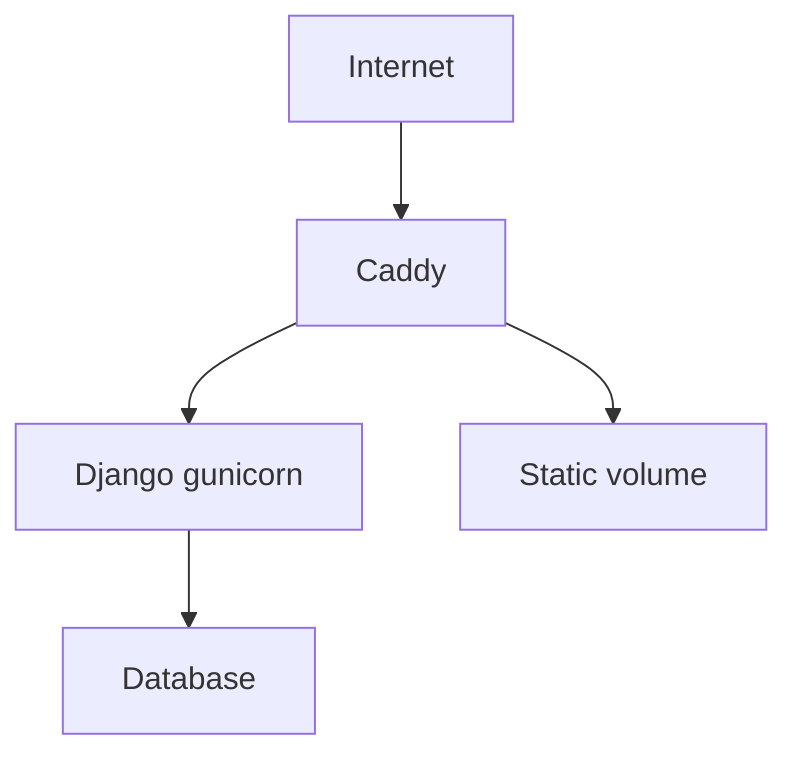

# 11 — Deployment and Infrastructure

## Local vs production
Local development usually uses `runserver` and SQLite.
Production deployment in this repository uses Docker, gunicorn, and Caddy.

## Production runtime flow
1. Container starts.
2. Migrations run.
3. Static files are collected.
4. Gunicorn serves Django app.
5. Caddy handles public HTTP/HTTPS and proxies to Django container.

## Mermaid


## Text fallback
```text
Internet traffic
  -> Caddy reverse proxy
  -> Django gunicorn container
  -> database
Caddy also serves collected static files from shared volume.
```

## Production checklist
- Set required environment variables.
- Confirm DB connectivity.
- Confirm S3 credentials and bucket permissions.
- Confirm SMTP works.
- Run migrations safely before cutover.

## Where in code
- Container startup command: `Dockerfile::CMD`
- Service topology: `docker-compose.yml::services`
- Reverse proxy rules: `Caddyfile`
- Production settings: `supplychain_test/supplychain_test/settings/production.py::DATABASES`
